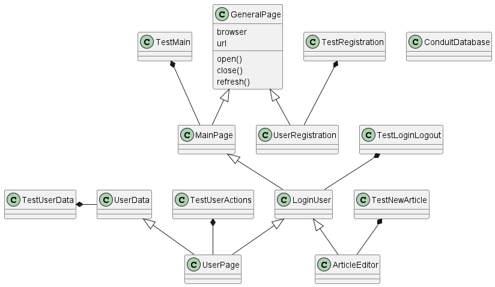

# Conduit tesztelés fejlesztői dokumentáció

## Osztálydiagramm

## Tesztesetek listája

- TC01. Conduit megjelenítése
- TC02.	Conduit adatkezelési nyilatkozat
- TC03.	Új felhasználó regisztrációja
- TC04.	10 felhasználó rögzítése fájlból
- TC05.	Felhasználó bejelentkezése
- TC06.	Nem létező felhasználó bejelentkezésének 	visszautasítása
- TC07.	Létező felhasználó kijelentkezése
- TC08.	Cikkek előnézetének listázása
- TC09.	Random cikk létrehozása
- TC10.	Létrehozott cikk törlése
- TC11.	Létrehozott cikk módosítása
- TC12.	Létrehozott felhasználó adatainak módosítása
- TC13.	Cikkek előnézetének listázása és mentése fájlba

### Vizsgakövetelményeknek megfelelés

1. Regisztráció
>A Registration osztály feladata a sikeres és sikertelen regisztráció
>végrehajtása és ellenőrzése frontend szinten
> [_**TC03**_](#TC03), _**TC04**_ tesztesetek
2. Bejelentkezés
>LoginUser osztály valósítja meg a bejelentkezés, kijelentkezés funkciót
> _**TC05**_, _**TC06**_, _**TC07**_ tesztesetek
3. Adatkezelési nyilatkozat használata  
> **TC01**_ teszteset: Conduit megjelenítése 
> 
>_**TC02**_ testeset: MainPage osztály ellenőrzi a cookie panelt 
>és nyugtázza azt. 
4. Adatok listázása
>A **UserPage** osztály a bejelentkezett felhasználó által látható cikkek listáját
bejárja (_**TC08**_ testeset).
5. Több oldalas lista bejárása
>A **UserPage** osztály a bejelentkezett felhasználó által látható cikkek listáját
bejárja. (_**TC08**_ testeset)
> 
6. Új adat bevitel
> Az **ArticleEditor** osztály segítségével az új cikk létrehozása lapra navigálunk
> és új random cikket hozunk létre a _*create_article()__ metódus segítségével
> Lásd még a [7. pont](Devs#7.) (_**TC09**_ teszteset)
7. Ismételt és sorozatos adatbevitel adatforrásból
> A **Registration** osztály sorozatos 
>felhasználóregisztrációt valósít meg az _*insert_users_from_file*_
>metódus segítségével 
> (_**TC04**_ teszteset)
8. Meglévő adat módosítás
> Az **ArticleEditor** osztály _*edit_article()*_ metódus segítségével egy létrehozott 
>cikk módosítása. ( _**TC11**_ teszteset)
> 
> Az **UserData** osztály _*change_user_data()*_ metódusa (_**TC12**_ teszteset)
> 
9. Adat vagy adatok törlése
>Az **ArticleEditor** osztály _*delete_article()*_ metódus segítségével egy létrehozott 
>cikk törlése A _**TC10**_ teszteset
10. Adatok lementése felületről
>A **UserPage** osztály a bejelentkezett felhasználó által látható cikkek listáját
bejárja és lementi a _article_previews.csv_ fájlba (_**TC13**_ testeset)
11. Kijelentkezés
> A **LoginUser** osztály valósítja meg a kijelentkezést a _logout()_ mtódus
> segítségével (_**TC07**_ teszteset)
