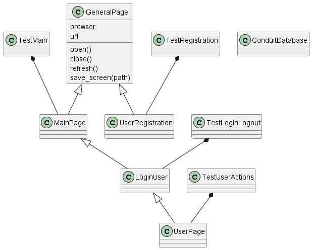

# Tesztesetek fejlesztői dokumentáció

## Osztálydiagramm

1. Regisztráció
>A Registration osztály feladata a sikeres és sikertelen regisztráció
>végrehajtása és ellenőrzése frontend szinten
> _**TC03**_, _**TC04**_ tesztesetek
2. Bejelentkezés
>LoginUser osztály valósítja meg a bejelentkezés, kijelentkezés funkciót
> _**TC05**_, _**TC06**_, _**TC07**_ tesztesetek
3. Adatkezelési nyilatkozat használata  
> **TC01**_ teszteset: Conduit megjelenítése 
> 
>_**TC02**_ testeset: MainPage osztály ellenőrzi a cookie panelt 
>és nyugtázza azt. 
4. Adatok listázása
>
5. Több oldalas lista bejárása
>A **UserPage** osztály a bejelentkezett felhasználó által látható cikkek listáját
bejárja, és elmenti _article_previews.csv_ fájlban 
>A _**TC08**_ testeset hajtja végre.
> 
6. Új adat bevitel
> Az **ArticleEditor** osztály segítségével az új cikk létrehozása lapra navigálunk
> és új random cikket hozunk létre a _*create_article()__ metódus segítségével
7. Ismételt és sorozatos adatbevitel adatforrásból
> A **Registration** osztály sorozatos 
>felhasználóregisztrációt valósít meg az insert_users_from_file
>metódus segítségével
9. Meglévő adat módosítás
9. Adat vagy adatok törlése
10. Adatok lementése felületről
11. Kijelentkezés
> A **LoginUser** osztály valósítja meg a kijelentkezést a _logout()_ mtódus
> segítségével